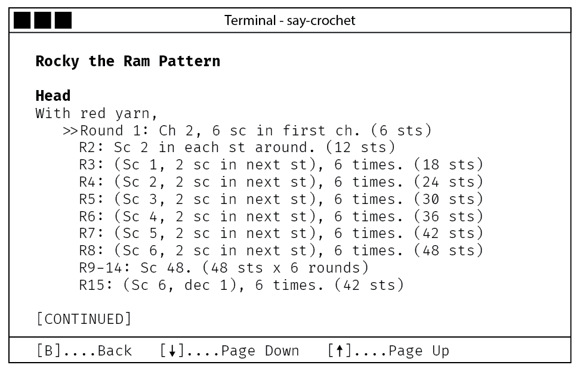

# Final Proposal

# Tracking Progress in a Crochet Pattern with Speech Recognition

Honors Project Proposal by Brent Gannetta

CS 231 Advanced Python Programming

City College of San Francisco

# Project Summary

This program will track a user's progress as they work through a crochet pattern using speech recognition. The project is inspired by my tendency to drop stitches while crocheting due to distractions. An accurate stitch count is necessary to produce a quality crocheted project. The user will read along with the displayed crochet pattern and the program will keep track of where the user is in the pattern, alerting the user if they have made a mistake and how to fix it. I intend to make the project open source.

# Interactivity

- Text User Interface (TUI) for menus and pattern tracking
- Voice recognition and voice synthesis for two-way verbal interaction with user
- Startup and main menu

- Main menu page with management commands.
- Note: Setup is for the microphone and audio output settings, allowing the user to choose a source and output device. Defaults to system default, if any.
- Pattern tracking

- The user has completed the 2 chains (ch) and 3 stitches (st) of the round. Stitch numbers the user has completed are greyed. The current stitch is highlighted and bolded. Special instructions are pattern instructions that are not quantifiable, such as instructions for how to sew pieces together.
- Commands (where Round may also be Row depending on the project)
    - Undo: Undoes whatever action the voice recognition took last.
    - Pause Listening: Pauses the voice recognition.
    - Next round: Goes to the next round.
    - Read Round Instructions: Reads the round instructions aloud to the user via voice synthesis.
    - Frog: Alert the program to the user ripping out (frogging) # number of stitches. Program will back up that many stitches.
    - View Pattern: Switches the view to show the whole pattern.
    - Exit: Pauses voice recognition, exits project to main menu.
- View Pattern

- Displays the pattern in full to the user. Pattern is displayed as it would be in print.
- Commands
    - Back: Returns to the previous mode (Pattern tracking)
    - Page Down / Page Up: Replaces the screen with the next page or previous page of the pattern. “Page” refers to the amount of information that can be displayed on one screen and is not a reference to a physical page in the printed pattern.

# Stretch Goals

- Near-term
    - pattern processing service that converts patterns found on the web into the custom JSON file format. The processing service needs to understand multiple styles of patterning and differences between US and UK terminology. Requires use of a web scraping library like Beautiful Soup.
- Long-term
    - Train custom voice models for the user using machine learning that allow the program to accept only the user’s voice commands and reject commands from others.
    - Web app version with Python backend with both desktop and mobile interfaces.

# Implementation Details

- PyAudio
    - What: Cross-platform audio library for input and output
    - Where: [https://pypi.org/project/PyAudio/](https://pypi.org/project/PyAudio/)
    - Why: Microphone input and speaker output, necessary to interact with SpeechRecognition without static audio files
    - Familiarity: never used
- pyttsx3
    - What: Offline text-to-speech conversion library
    - Where: [https://pypi.org/project/pyttsx3/](https://pypi.org/project/pyttsx3/)
    - Why: Provide verbal feedback to the user. Eliminates the need for an internet connection as required with other TTS conversion libraries.
    - Familiarity: never used
- SpeechRecognition
    - What: Speech Recognition library for converting speech-to-text
    - Where: [https://pypi.org/project/SpeechRecognition/](https://pypi.org/project/SpeechRecognition/) and [https://realpython.com/python-speech-recognition/](https://realpython.com/python-speech-recognition/) (tutorial)
    - Why: I originally wanted to use TensorFlow but the Windows version will soon require WSL2. This would mean the program would be less compatible with different environments.
    - Familiarity: never used
- Textual
    - What: Cross-platform Textual User Interface (TUI)
    - Where: [https://textualize.io](https://textualize.io/)
    - Why: TUI with widgets, mouse support.
    - Familiarity: never used
- JSON
    - What: JSON parser
    - Where: [https://docs.python.org/3.8/library/json.html](https://docs.python.org/3.8/library/json.html)
    - Why: Custom JSON file format for pattern files, settings, and projects which will make pattern files and projects portable.
    - Familiarity: never used

# Programming Environment

- PyCharm - I am experienced with IntelliJ, which has a very similar interface.
- Python - I've taken CS 110A: Intro to Computer Programming (Python Introduction) and CS 131B: Fundamentals of Programming: Python. I am currently taking CS 231: Advanced Python Programming and MATH 108: Foundations of Data Science, all of which use Python. Additionally, I teach Intro to Python at Mission Bit, a non-profit that helps get kids who wouldn’t otherwise have access to tech education into programming and coding classes.
- Venv - I am familiar with creating virtual environments in Python and creating requirements.txt

# Git Proficiency

Prior to this project I had used git and knew how to init and clone repositories, add and rm files from a commit, commit, use a .gitignore file, etc. I had not had any experience with git’s collaboration functions.

Github repository: [https://github.com/hellapythonic/say-crochet-honors-project](https://github.com/hellapythonic/say-crochet-honors-project)

# Implementation Concerns

I have not worked with speech synthesis or speech recognition before. These technologies are crucial to the success of this program.

The JSON file format and the custom iterator data structure will need to be built from the ground up.

# Tasks

Notion Board:

[https://equatorial-methane-1b8.notion.site/CS-231-Honors-Project-94eacee63bb246939306da502883fc1c](https://www.notion.so/CS-231-Honors-Project-94eacee63bb246939306da502883fc1c)

- Meet in 1 week to discuss next steps, every other week after that
- Meet after major milestones are completed to discuss instructor feedback
- Use Case
- Requirements Gathering
- Custom JSON file format
- Custom iterator data structure
- Build
- Test
- Bug Fixing
- Future Enhancements